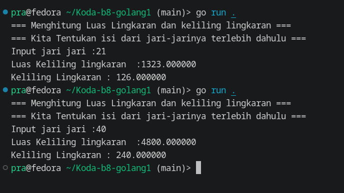

# Circle calc 

simple go program to calculation area and circumreference of a circle 

## Feat
1. User Input jari jari 
2. Calculate circle area 
3. Calculate circle circumreference

## Demo / Result

